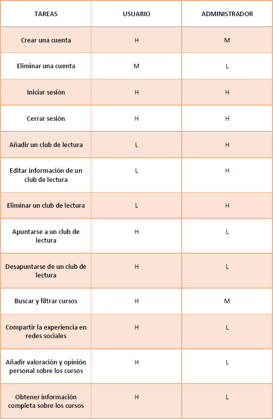
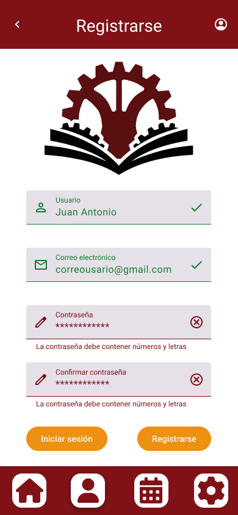

# DIU24
Prácticas Diseño Interfaces de Usuario 2023-24 (Tema: .... ) 

Grupo: DIU1_Tech-X.  Curso: 2023/24 
Updated: 20/03/2024

Proyecto: 

Club de Lectura en La Estupenda

Descripción: 

La idea es añadir Clubes de Lectura a los cursos interpretativos que se encuentran en la web, ya que con esto conseguimos ampliar el ámbito literario de los cursos y, además, un Club de Lectura dura unas pocas semanas y es considerablemente más barato que cualquier curso de intepretación, lo que atrae a nuevos usuarios y permite la integración de estos al resto de eventos y formaciones de la página.

Logotipo: 

Miembros
 * :bust_in_silhouette:   Emanuel Giraldo Herrera     :octocat: 

----- 

# Proceso de Diseño 

## Paso 1. UX User & Desk Research & Analisis 

 **1.a User Reseach Plan**
-----

El plan de User Research se centra en comprender las necesidades y preferencias de los usuarios al buscar y organizar iniciativas turísticas en Granada, específicamente en el ámbito del Espacio Escénico Teatral, con el objetivo de mejorar la experiencia de usuario en la plataforma web correspondiente ([Espacio La Estupenda](https://espaciolaestupenda.com/)). Para lograr esto, se emplearán métodos de investigación como análisis de competidores, creación de personas, journey maps o usabilities reviews.

En el análisis de competidores se utilizarán dos proyectos similares que puedan o hagan competencia a la opción elegida. Mientras que para las personas se representarán diversos perfiles de usuario, incluyendo la mayor variedad posible, se explorarán en detalle sus necesidades, comportamientos y preferencias al buscar eventos turísticos. 

Los resultados de la investigación se utilizarán para informar el diseño y desarrollo de la plataforma web, con el objetivo de aumentar la satisfacción del cliente y mejorar la experiencia de usuario en la búsqueda y organización de iniciativas turísticas en Granada.

 1.b Competitive Analysis
-----

Hemos seleccionado como la página a analizar [La Estupenda](https://espaciolaestupenda.com/) y como competidoras a proyectos con enfoques distintos pero que inciden en el mismo grupo de usuarios objetivo de nuestro proyecto. Entre estos proyectos competidores hemos elegido a [La Buia Espacio Creativo](https://labuiaespaciocreativo.es/), espacio creativo de teatro, circo y danza de Granada, más dedicado a la realización de cursos y obras de teatro; y a [La Llama](https://lallamastore.com/), tienda de comedia en Barcelona donde se organizan numerosos eventos de teatrales o interpretativos de todo tipo.

Las características que hemos seleccionado para la comparativa son los cursos de los que se dispone, el merchandising disponible y los eventos que se organizan; la multimedia de la web, la adaptabilidad de los recursos y la interactividad; la personalización, la búsqueda de información y los comentarios o retroalimentación de los clientes; la estructura, la legibilidad y la navegación; y los puntos fuertes, los puntos débiles y las conclusiones.

 1.c Persona
-----

Hemos seleccionado a Julián y a María con la intención de representar el espectro más amplio posible de usuarios objetivo, garantizando perfiles distintos en edad, sexo, intereses, situación socioecnomica y personalidad. Julián es un usuario que nos sirve para parametrizar la web con personas jóvenes, estudiantes, intereses realcionados parcialmente con el teatro y con una actitud proactiva respecto a este. Mientras tanto, María es una usuaria que integra verdaderamente bien caracterisitcas en otros grupos poblacionales como personas de mediana edad, trabajadoras, interés específico en el teatro y la interpretación y con una actitud titubeante ante estos. 

 1.d User Journey Map
----

Las expericias de usuario escogidas han sido elegidas dada la asiduidad con la que suceden y a lo bien que representan la personalidad y el contexto personal de cada una de las personas. Si bien, no creemos que correspondan exactamente a la misma experiencia de muchos usuario, las dos actúan de forma similar a las personas englobando numerosos pequeños casos posibles dentro de cada experiencia, lo que nos permite abarcar un amplio terreno en la representación de estas y su interacción con la página de [La Estupenda](https://espaciolaestupenda.com/).

 1.e Usability Review
----

El [Usability Review](https://github.com/emanuelugr/DIU/blob/master/P1/P1-7%20Usability%20Review.pdf) que hemos realizado nos arroja una puntación total de 70 (Good).

Esta puntuación indica con exactitud nuestro análisis de la página web seleccionada, ya que, aunque podemos catalogarla como una página web correcta, que cumple sus funciones básicas, tiene errores vertebrales en cosas como su estructura, su personalización o su retroalimentación, entre otros compenentes, lo que lleva a pensar que es mejorable en muchos aspectos.

## Paso 2. UX Design  

 2.a Reframing / IDEACION: Feedback Capture Grid / EMpathy map 
----

La propuesta de valor para el nuevo diseño de la aplicación sería ofrecer una experiencia única de clubes de lectura que complementen la oferta existente de formación y espectáculos teatrales. Esta nueva función proporcionaría una oportunidad para que los usuarios exploren y discutan una amplia variedad de libros en un entorno interactivo y enriquecedor. Además, al ser una opción más corta y económica que los espectáculos teatrales, permitiría a un público más amplio acceder a actividades culturales de alta calidad. La combinación de formación, entretenimiento y ahora también lectura, consolidaría a La Estupenda como un destino integral para la cultura y el aprendizaje.

 2.b ScopeCanvas
----

 2.b User Flow (task) analysis 
-----

Iniciar sesión:

Apuntarse a un club de lectura:

Añadir valoración y opinión personal sobre los cursos:

 2.c IA: Sitemap + Labelling 
----

 2.d Wireframes
-----

## Paso 3. Mi UX-Case Study (diseño)

 3.a Moodboard
-----

En el Moodboard incluimos los principales elementos de diseño a considerar antes de comenzar con el bocetaje HI-FI de la aplicación, para ello hemos creado un logotipo, con la herramiento [Recraft.io](https://www.recraft.ai/). Hemos utilizado para este logo una alta resolución para no perder detalles en formatos pequeños y que tampoco se vea borroso en formatos grandes. Además, hemos creado diferentes versiones que se adapten a las necesidades de nuestra página.

  3.b Landing Page
----

Con intención de promocionar la aplicación, se ha bocetado una página web Onboarding para atraer la atención del usuario. Para ello, hemos usado una imagen que represente fielmente tanto el estilo y, por extensión, los valores que que queremos transmitir, como los detalles diferenciales de nuestra propuesta.

 3.c Guidelines
----

Para hablar sobre los patrones utilizados, debemos hacer una categorización inicial según el tipo de componentes afectados:

* Búsqueda:

Patrón de caja de búsqueda: Empleado en las vistas principales de la aplicación para permitir al usuario filtrar y buscar correctamente los elementos que necesite.

* Navegación:

Navegación por pestañas: Utilizada tanto en el menú del ítem como en el menú principal accesible desde todas las vistas. Proporciona una forma intuitiva y cómoda de agrupar los componentes prinicipales de la aplicación.

* Tareas:

Formato estructurado: Enfocado en formularios de entrada de datos y en todas las listas de elementos de la aplicación.

* Otros aspectos específicos:

Calendario: Usado para la organización de fechas de eventos próximos tanto inscritos como no inscritos.

Ajustes: Adaptado para la vista de ajustes del sistema.

Valoración: Usado para el sistema de valoración de las formaciones disponibles.

  3.d Mockup
----

A continuación, se incluyen una serie de bocetos Hi-Fi de la aplicación.

-----

## Paso 4. Evaluación 

 4.a Caso asignado
----

En este apartado vamos a analizar el trabajo realizado por el grupo [DIU3_14_AveFenix](https://github.com/G3rarB0net/DIU), que han llevado a cabo la aplicación Mountain Sports.

Mountain Sport es una aplicación dedicada a las actividades de montaña, la cual pretende ofrecer a todos sus usuarios una plataforma donde poder inscribirse en multitud de experiencias deportivas por zonas rurales más y menos conocidas, donde todas destacan por su enorme belleza, sus vistas impresionantes y su gran altitud.

 4.b User Testing
----

Mediante el uso de tiradas de dados hemos creado las personas necesarias para esta sección intentando cubrir el máximo tipo de usuario objetivo que podemos abarcar.
Para el prototipo A (Clubes de lectura):

Persona 1 (Laura Martínez)

* Tipo: Usuaria activa

* Actividad: Participación constante en clubes de lectura y foros

* Emoción: Motivada por el aprendizaje y el intercambio de ideas

* Necesidades: interfaz intuitiva y atractiva, foros activos y moderados para discusiones literarias y notificaciones que avisen de nuevos eventos y discusiones.

* Situaciones conflicitvas: si la interfaz no es muy intuitiva podría desanimarse después de un primer impulso por participar en cualquiera de estas actividades, de la misma forma, estando tan interesada, tendría un grave problema con no recibir notificaciones actualizadas sobre los eventos que le interesan.

Persona 2 (Jorge Gutiérrez)

* Tipo: Usuario ocasional

* Actividad: Búsqueda de eventos literarios específicos

* Emoción: Interesado, pero con poco tiempo

* Necesidades: fácil acceso a un calendario de eventos, sistema sencillo y cómodo de registrarse e iniciar sesión y la posibilidad de inscribirse rápidamente a cualquier evento.

* Situaciones conflicitvas: en este caso, el gran problema es el tiempo, por tanto, si la aplicación no es eficiente y clara y no ofrece una forma rápida y simple de registrase e inciar sesión, así como de inscribirse a un evento, perdería todo el interés.

Para el prototipo B (Actividades de montaña):

Persona 3 (Ana Botín)

* Tipo: Usuaria experta

* Actividad: Planificación de rutas y actividades avanzadas

* Emoción: Apasionada y exigente

* Necesidades: mapas detallados y actualizados, información precisa sobre rutas y condiciones del tiempo y opciones para compartir rutas y experiencias en redes sociales.

* Situaciones conflictivas: si los mapas no están bien detallados y desactualizados podría frustrarse y no querer repetir la experiencia. También es muuy importante para ella poder compartir su experiencia con sus amigos en redes y recibir retroalimentación.

Persona 4 (Carlos Fernández)

* Tipo: Usuario principiante

* Actividad: Búsqueda de actividades de iniciación

* Emoción: Motivado pero inexperto

* Necesidades: guías y tutoriales para principiantes, recomendaciones de rutas por dificultad, foro de comunidad para preguntas y consejos.

* Situaciones conflictivas: si no encuentra guías y tutoriales claros para principiantes, así como que las rutas y actividades no hagan referencia a la dificultad o vea únicamente en los comentarios gente que parezca ser experta, podría sentirse completamente abrumado y nada motivado.

| Usuarios          | Sexo/Edad | Ocupación                 |  Exp.TIC  | Personalidad  | Plataforma | TestA/B  |
| ----------------- | --------- | ------------------------- | --------- | ------------- | ---------- | -------- |
| Laura Martínez    | H / 32    | Profesora de literatura   | Alta      | Sociable      | Móvil      | A        |
| Jorge Gutiérrez   | M / 57    | Abogado                   | Media     | Racional      | Web        | A        |
| Ana Botín         | F / 21    | Estudiante                | Media     | Exigente      | Móvil      | B        |
| Carlos Fernández  | H / 43    | Ingeniero informático     | Alta      | Inseguro      | Web        | B        |

 4.c Cuestionario SUS
----

Observando los resultados, vemos como ambas aplicaciones obtienen un resultado Aceptable Tipo B (Excelente) y un resultado Marginal Tipo D.

#USER1 (Laura): se muestra muy cómoda con el sistema y logra una alta usabilidad, lo que provoca que se encuentre muy satisfecha.

#USER2 (Jorge): si bien se siente a gusto con los contenidos y la planificación de la aplicación, lo que le permite buscar y centrarse en sólo los eventos que le interesan, está algo perdido con las tecnologías y le cuesta usarla cómodamente.

#USER3 (Ana): disfruta muchísimo de la idea de la aplicación y los mecanismos que ofrece, tiene una experiencia satisfactoria.

#USER4 (Carlos): entiende bien la aplicación y obtiene un buena usabilidad, sin embargo al ser principiante en el mundillo se encuentra totalmenete perdido con los contenidos y las referencias a muchos elementos dentro del sistema, lo que provoca que no se sienta del todo cómodo.

Como conclusiones de los casos que hemos analizado, extrapolarlo más allá es díficil con los limitados perfiles usados, ambos prototipos tiene ideas claras, mantienen una jerarquía y diseño coherente y ofrecen mecanismos sencillos y útiles, sin embargo, puede que el prototipo A deje más vendido a usuarios con poca experiencia con la tecnología en cuestiones de diseño, dado su minimalismo, y el prototipo B no tenga muy cuenta los usuarios con poca experiencia en el campo en cuestiones de diseño, dado a la falta de tags o de indicadores más allá de descripciones técnicas.

 4.d Usability Report
----

El Usability Report se puede encontrar [aquí](P4/readme.md)

En cuanto a la valoración personal, nos parece que el prototipo presentado por nuestros compañeros está muy logrado, la paleta de colores es llamativa y consistente, la interfaz y sus iconos son modernos y atractivos y algunas de las funcionalidades que presenta nos han resultado realmente interesantes. Para incluir algún comentario de mejora, nos parece que falta inforamción en las actividades como mapas, rutas detalladas o categorías de dificultad, e información en la reserva y calendarios como datos sobre el tiempo o los ciclos de luz solar.

5.) Conclusion de EVALUACION (A/B testing + usability report + eye tracking) 
----

>> recupera el usability report de tu práctica (que es el caso B de los asignados a otros grupos) 
>> con los resultados del A/B testing, de eye tracking y del usability report:
>>  comentad en 2-3 parrafos cual es la conclusion acerca de la realización de la práctica y su evaluación con esas técnicas y que habéis aprendido

## Paso 5. Exportación & evaluación con Eye Tracking 

Exportación a HTML/Flutter
-----

)  5.b Eye Tracking method 

>>> Indica cómo diseñas experimento y reclutas usuarios (uso de gazerecorder.com)  

Diseño del experimento 
----

>> Uso de imágenes (preferentemente) -> hay que esablecer una duración de visualización y  
>> fijar las áreas de interes (AoI) antes del diseño. Planificar qué tarea debe hacer el usuario (buscar, comprar...) 

  
>> cambiar img por tu diseño de experimento  

>> Recordar que gazerecorder es una versión de pruebas: usar sólo con 3 usuarios para generar mapa de calor (recordar que crédito > 0 para que funcione) 

Resultados y valoración 
-----

>> Cambiar por tus resultados
  

## Conclusión final / Valoración de las prácticas

>>> (90-150 palabras) Opinión FINAL del proceso de desarrollo de diseño siguiendo metodología UX y valoración (positiva /negativa) de los resultados obtenidos  

